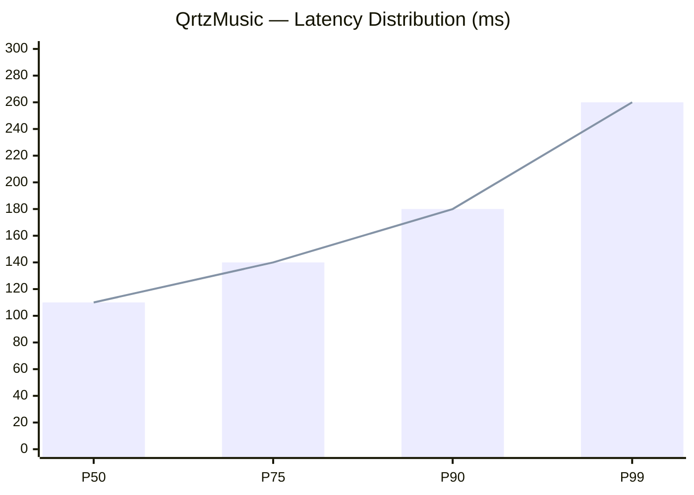

<div align="center">

<br /><br />


<br /><br />


<br /><br />

[](https://github.com/meguminn1)
&nbsp;
[](https://github.com/meguminn1?tab=followers)
&nbsp;
[](https://github.com/meguminn1)

</div>

---

##  About Me

```ts
const megumin = {
  name: "Megumin",
  role: "Backend Engineer & System Designer",
  location: "Indonesia",
  vibe: "soft blue · cute · clean · reliable",

  focus: [
    "Serverless architecture",
    "REST & queue API design",
    "Clean code & maintainability",
    "Low-latency system patterns",
  ],

  currently: {
    building: "QrtzMusic — no auth, no DB, fully client-driven",
    learning: "Advanced queue systems with BullMQ + Redis",
    exploring: "Edge functions & low-latency patterns",
    obsessing: "Clean API contracts & graceful error boundaries",
  },

  stack: {
    backend: ["Node.js", "TypeScript", "Python", "BullMQ", "Redis"],
    frontend: ["Next.js", "React", "Tailwind CSS"],
    infra: ["Docker", "Vercel", "Serverless Functions"],
    tools: ["Git", "Postman", "VS Code", "Insomnia"],
  },

  philosophy: "Build simple. Scale only when needed. Design it right from the start.",
  openTo: ["Collabs", "Open Source", "Interesting Problems"],
};
```

## Current Status

<table>
<tr>
<td width="50%" valign="top">

```yaml
# Now Building
project  : QrtzMusic v2
status   : Active development
pattern  : Serverless · Zero-auth
storage  : Client-side only
deploy   : Vercel Edge Network
uptime   : 99%+
```

</td>
<td width="50%" valign="top">

```yaml
# Currently Studying
primary  : BullMQ advanced patterns
secondary: Redis Streams & Pub/Sub
side     : Edge function optimization
reading  : Clean Architecture
goal     : < 100ms p50 latency
```

</td>
</tr>
</table>

## Philosophy

| Principle | Meaning |
|:--|:--|
| Think in flows | Trace the data path, not just the function |
| Prefer stateless | Scalable by design, not by luck |
| Optimize for latency | UX is a first-class concern |
| Single responsibility | Every component owns exactly one thing |
| Secure by default | Auth, rate-limit, validate — always |
| Ship incrementally | Small, testable, deployable units |
| Design contracts first | Shape the API before writing code |
| Fail gracefully | Every error path matters |

> The best system is one you can explain in 5 minutes but runs for 5 years.

## System Design — QrtzMusic


<br />

<p align="center">
  
  
  
</p>

<p align="center">
  
  
  
  
</p>



> Zero-auth removes session overhead. Client-side storage eliminates DB round-trips. Serverless gives instant global scale. Every decision traces back to one goal: user experience.

## Tech Stack

<table>
<tr>
<td align="center" width="25%">

**Backend & Runtime**


`Node.js` · `TypeScript` · `Python` · `Bun`

</td>
<td align="center" width="25%">

**Frontend**


`Next.js` · `React` · `Tailwind` · `JavaScript`

</td>
<td align="center" width="25%">

**Infra & Queue**


`Vercel` · `Redis` · `BullMQ` · `Docker`

</td>
<td align="center" width="25%">

**Tools & Workflow**


`Git` · `GitHub` · `VS Code` · `Postman`

</td>
</tr>
</table>

## Featured Projects

<table>
<tr>
<td width="50%" valign="top">

### QrtzMusic

Music streaming platform — no login, no DB, fully client-driven.


- Zero-auth — no session, no cookies, no friction
- Client-side storage — zero DB round-trips
- AI-powered recommendations via Kobeni Service
- Auto-scaling on Vercel Edge Network
- YouTube API integration for sourcing tracks
- P50 latency: **110ms** | Uptime: **99%+**

</td>
<td width="50%" valign="top">

### Qrtznime

UI/UX-focused immersive anime web experience.


- Immersive anime discovery & browsing UI
- Smooth micro-animations & page transitions
- Clean component-driven architecture
- Mobile-first & fully responsive layout
- Design system with consistent tokens
- Blazing-fast search & filter UX

</td>
</tr>
</table>

<table>
<tr>
<td width="100%" valign="top">

### Kobeni Service

The AI microservice powering QrtzMusic's smart recommendations.


- Queue-based job processing with BullMQ + Redis
- AI-driven music curation & playlist generation
- Decoupled from main app — fault-tolerant by design
- Rate-limited, validated, and stateless

</td>
</tr>
</table>

## Roadmap — The Scraper Empire

> Building a distributed scraper ecosystem — one target at a time.  
> Every service: independent · stateless · queue-driven · rate-limited.

```text
╔══════════════════════════════════════════════════════════════════╗
║               SCRAPER ECOSYSTEM — meguminn1                     ║
╠══════════════════════════════════════════════════════════════════╣
║                                                                  ║
║  PHASE 1 — Foundation                               SHIPPED     ║
║  ├─ QrtzMusic YouTube Scraper  [Node.js · BullMQ]               ║
║  └─ Kobeni AI Service          [Serverless · Redis]              ║
║                                                                  ║
╠══════════════════════════════════════════════════════════════════╣
║                                                                  ║
║  PHASE 2 — Scraper Army                             BUILDING     ║
║  ├─ Anime Metadata Scraper     [Python · Cheerio]   WIP         ║
║  ├─ Lyrics Scraper             [Node.js · Queue]    WIP         ║
║  ├─ Music Chart Scraper        [TypeScript]         PLANNED     ║
║  ├─ Trending Topics Scraper    [BullMQ · Redis]     PLANNED     ║
║  └─ Social Media Feed Scraper  [Puppeteer]          PLANNED     ║
║                                                                  ║
╠══════════════════════════════════════════════════════════════════╣
║                                                                  ║
║  PHASE 3 — Orchestration                            FUTURE      ║
║  ├─ Unified Scraper Gateway    [API · Rate Limit]   SOON        ║
║  ├─ Scraper Worker Cluster     [Queue · BullMQ]     SOON        ║
║  ├─ Real-time Data Pipeline    [Redis Streams]      SOON        ║
║  └─ Open-source Scraper SDK    [npm package]        SOON        ║
║                                                                  ║
╚══════════════════════════════════════════════════════════════════╝
```

## Achievements & Stats

<div align="center">


<br /><br />


<br /><br />


<br /><br />


<br /><br />


<br /><br />


&nbsp;

&nbsp;


</div>

## Contribution Snake

<div align="center">


</div>

## Random Dev Thought

<div align="center">


</div>

## Connect With Me

<div align="center">

<a href="https://t.me/rynaaqrtz">
  
</a>
&nbsp;&nbsp;
<a href="https://github.com/meguminn1">
  
</a>

<br /><br />


<br /><br />


<br /><br />


<br /><br />

<sub>𓂃 ✦ <b>meguminn1</b> ✦ 𓂃</sub>

</div>


