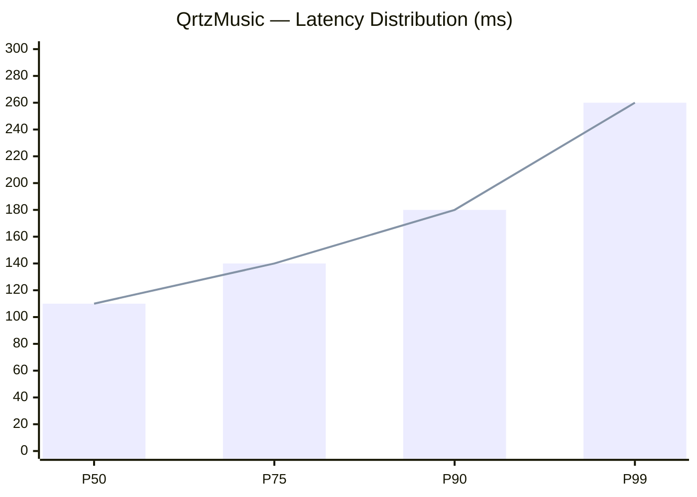

<div align="center">


<br/><br/>


<br/><br/>

[](https://github.com/meguminn1)
&nbsp;
[](https://github.com/meguminn1?tab=followers)
&nbsp;
[](https://github.com/meguminn1)

</div>

<br/>


##  &nbsp;`< About Me />`

<br/>

```typescript
const megumin: Developer = {
  name      : "Megumin",
  role      : "Backend Engineer & System Designer",
  location  : "🌏 Indonesia",

  focus     : [
    "Serverless Architecture",
    "REST & Queue API Design",
    "Clean Code & Maintainability",
    "Low-Latency System Patterns",
  ],

  currently : {
    building  : "QrtzMusic — no auth, no DB, fully client-driven 🎧",
    learning  : "Advanced Queue Systems with BullMQ + Redis",
    exploring : "Edge Functions & low-latency patterns",
    obsessing : "Clean API contracts & graceful error boundaries",
  },

  stack     : {
    backend   : ["Node.js", "TypeScript", "Python", "BullMQ", "Redis"],
    frontend  : ["Next.js", "React", "Tailwind CSS"],
    infra     : ["Docker", "Vercel", "Serverless Functions"],
    tools     : ["Git", "Postman", "VS Code", "Insomnia"],
  },

  philosophy : "Build simple. Scale only when needed. Design it right from the start.",
  openTo     : ["Collabs 🤝", "Open Source 🌱", "Interesting Problems 🌸"],
};
```

<br/>


## 🎧 &nbsp;Current Status

<br/>

<div align="center">

<table>
<tr>
<td width="50%" valign="top">

```yaml
# 📡 Now Building
project  : QrtzMusic v2
status   : 🟢 Active Development
pattern  : Serverless · Zero-Auth
storage  : Client-Side Only
deploy   : Vercel Edge Network
uptime   : 99%+ 🚀
```

</td>
<td width="50%" valign="top">

```yaml
# 📚 Currently Studying
primary  : BullMQ advanced patterns
secondary: Redis Streams & Pub/Sub
side     : Edge Function optimization
reading  : "Clean Architecture" - Uncle Bob
goal     : < 100ms p50 latency 🎯
```

</td>
</tr>
</table>

</div>

<br/>


## 🎵 &nbsp;Now Playing on Spotify

<br/>

<div align="center">

[](https://open.spotify.com/user/31umwsbz4qfsv7feixuu5evcaj6m)

<br/>

<sub><i>🎵 Last 3 tracks · updates automatically · click to open Spotify profile</i></sub>

</div>

<br/>


## 🌸 &nbsp;Philosophy & Principles

<br/>

<div align="center">

| &nbsp; | Principle | What it means |
|:---:|:---|:---|
| 🧠 | **Think in flows** | Trace the data path, not just the function |
| ⚙️ | **Prefer stateless** | Scalable by design, not by luck |
| ⚡ | **Optimize for latency** | UX is a first-class concern |
| 🧩 | **Single responsibility** | Every component owns exactly one thing |
| 🔒 | **Secure by default** | Auth, rate-limit, validate — always |
| 📦 | **Ship incrementally** | Small, testable, deployable units |
| 🎯 | **Design contracts first** | Shape the API before writing a single line |
| 🌱 | **Fail gracefully** | Every error path is a first-class citizen |

<br/>

> *"The best system is one you can explain in 5 minutes but runs for 5 years."*

</div>

<br/>


## 🏗️ &nbsp;System Design — QrtzMusic

<br/>

<div align="center">


<sub><i>🎧 Full Architecture — QrtzMusic &nbsp;|&nbsp; Client-First &nbsp;·&nbsp; Serverless &nbsp;·&nbsp; Zero-Auth</i></sub>

<br/><br/>


<br/>


</div>

<br/>



<br/>

> **Design Decisions:**&nbsp; Zero-auth removes session overhead entirely. Client-side storage eliminates DB round-trips. Serverless gives instant global scale. Every decision traces back to one goal: **user experience**.

<br/>


## 🧠 &nbsp;Tech Stack

<br/>

<div align="center">

[](https://github.com/meguminn1)

<br/>

[](https://github.com/meguminn1)

<br/><br/>

<table>
<tr>
<td align="center" width="25%">

**⚙️ Backend & Runtime**


`Node.js` &nbsp;`TypeScript`
`Python` &nbsp;`Bun`

</td>
<td align="center" width="25%">

**🎨 Frontend**


`Next.js` &nbsp;`React`
`Tailwind` &nbsp;`JavaScript`

</td>
<td align="center" width="25%">

**☁️ Infra & Queue**


`Vercel` &nbsp;`Redis`
`BullMQ` &nbsp;`Docker`

</td>
<td align="center" width="25%">

**🛠️ Tools & Workflow**


`Git` &nbsp;`GitHub`
`VS Code` &nbsp;`Postman`

</td>
</tr>
</table>

</div>

<br/>


## 🚀 &nbsp;Featured Projects

<br/>

<div align="center">

<table>
<tr>
<td width="50%" valign="top">

### 🎧 QrtzMusic

> *Music streaming platform — no login, no DB, fully client-driven.*


<br/><br/>

- 🔓 Zero-auth — no session, no cookies, no friction
- 💾 Client-side storage — zero DB round-trips
- 🤖 AI-powered recommendations via Kobeni Service
- ⚡ Auto-scaling on Vercel Edge Network
- 🎵 YouTube API integration for sourcing tracks
- 📊 P50 latency: **110ms** &nbsp;|&nbsp; Uptime: **99%+**

</td>
<td width="50%" valign="top">

### 🌸 Qrtznime

> *UI/UX-focused immersive anime web experience.*


<br/><br/>

- 🎌 Immersive anime discovery & browsing UI
- ✨ Smooth micro-animations & page transitions
- 🧩 Clean component-driven architecture
- 📱 Mobile-first & fully responsive layout
- 🎨 Design system with consistent tokens
- 🔍 Blazing-fast search & filter UX

</td>
</tr>
</table>

<br/>

<table>
<tr>
<td width="100%" valign="top">

### 🤖 Kobeni Service

> *The AI microservice powering QrtzMusic's smart recommendations.*


<br/><br/>

- 🔁 Queue-based job processing with **BullMQ + Redis**
- 🧠 AI-driven music curation & playlist generation
- ⚡ Decoupled from main app — fault-tolerant by design
- 🔒 Rate-limited, validated, and stateless

</td>
</tr>
</table>

</div>

<br/>


## 🗺️ &nbsp;Roadmap — The Scraper Empire

<br/>

<div align="center">

> *Building a distributed scraper ecosystem — one target at a time.*
> *Every service: independent · stateless · queue-driven · rate-limited.*

<br/>

```
╔══════════════════════════════════════════════════════════════════╗
║               🌐  SCRAPER ECOSYSTEM  —  meguminn1                   ║
╠═══════════════════════════════════════════════════════════��══════╣
║                                                                      ║
║  PHASE 1 — Foundation                               ✅  SHIPPED      ║
║  ├─ QrtzMusic YouTube Scraper  [Node.js · BullMQ]                   ║
║  └─ Kobeni AI Service          [Serverless · Redis]                  ║
║                                                                      ║
╠══════════════════════════════════════════════════════════════════╣
║                                                                      ║
║  PHASE 2 — Scraper Army                             🔨  BUILDING     ║
║  ├─ Anime Metadata Scraper     [Python · Cheerio]   🟡 WIP          ║
║  ├─ Lyrics Scraper             [Node.js · Queue]    🟡 WIP          ║
║  ├─ Music Chart Scraper        [TypeScript]         🔵 PLANNED      ║
║  ├─ Trending Topics Scraper    [BullMQ · Redis]     🔵 PLANNED      ║
║  └─ Social Media Feed Scraper  [Puppeteer]          🔵 PLANNED      ║
║                                                                      ║
╠══════════════════════════════════════════════════════════════════╣
║                                                                      ║
║  PHASE 3 — Orchestration                            🔮  FUTURE       ║
║  ├─ Unified Scraper Gateway    [API · Rate Limit]   🔮 SOON         ║
║  ├─ Scraper Worker Cluster     [Queue · BullMQ]     🔮 SOON         ║
║  ├─ Real-time Data Pipeline    [Redis Streams]      🔮 SOON         ║
║  └─ Open-source Scraper SDK    [npm package]        🔮 SOON         ║
║                                                                      ║
╚══════════════════════════════════════════════════════════════════╝
```

<br/>

| Badge | Status |
|:---:|:---|
| ✅ | Shipped & running in production |
| 🟡 | In active development |
| 🔵 | Planned & designed |
| 🔮 | Future vision |

</div>

<br/>


## 🏆 &nbsp;Achievements & Stats

<br/>

<div align="center">


<br/><br/>


<br/><br/>


<br/><br/>


<br/>


<br/>


&nbsp;

&nbsp;


</div>

<br/>


## 🐍 &nbsp;Contribution Snake

<br/>

<div align="center">


</div>

<br/>


## 💭 &nbsp;Random Dev Thought

<br/>

<div align="center">


</div>

<br/>


## 🌐 &nbsp;Connect With Me

<br/>

<div align="center">

<a href="https://t.me/rynaaqrtz">
  
</a>
&nbsp;&nbsp;
<a href="https://github.com/meguminn1">
  
</a>

<br/><br/>


<br/><br/>


<br/><br/>


<br/><br/>

<sub>𓂃 ✦ &nbsp; <b>meguminn1</b> &nbsp; ✦ 𓂃</sub>

<br/>

</div>


