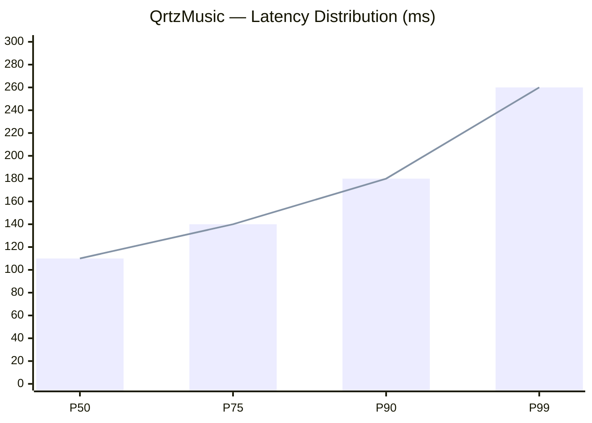

<div align="center">


<br />


<br />

[](https://github.com/meguminn1)
&nbsp;
[](https://github.com/meguminn1?tab=followers)
&nbsp;
[](https://github.com/meguminn1)

</div>

---

## ✦ About Me

```ts
const megumin = {
  name: "Megumin",
  role: "Backend Engineer & System Designer",
  location: "Indonesia",
  theme: "Nakano Miku • soft blue • cute anime • calm UI",

  identity: {
    mindset: "structured, practical, and detail-oriented",
    style: "clean layout, readable docs, and polished visuals",
    favoriteTone: "soft, minimal, premium, and friendly",
  },

  focus: [
    "Backend architecture",
    "REST API design",
    "Queue & worker systems",
    "Performance tuning",
    "Documentation quality",
    "Developer experience",
  ],

  currently: {
    building: "QrtzMusic — serverless, zero-auth, client-driven",
    polishing: "README design, feature blocks, and UI consistency",
    learning: "BullMQ, Redis, and event-driven patterns",
    exploring: "Edge functions and low-latency systems",
  },

  stack: {
    backend: ["Node.js", "TypeScript", "Python", "BullMQ", "Redis"],
    frontend: ["Next.js", "React", "Tailwind CSS"],
    infra: ["Docker", "Vercel", "Serverless Functions"],
    tools: ["Git", "GitHub", "VS Code", "Postman", "Insomnia"],
  },
};
```

---

## ✦ Core Features

<table>
<tr>
<td width="50%" valign="top">

### 🎀 Visual Theme
- Soft blue palette
- Anime cute aesthetic
- Wave-style banner
- Clean spacing
- Rounded card-style blocks
- Consistent icon usage
- Smooth section flow

</td>
<td width="50%" valign="top">

### ⚙️ Engineering Style
- Modular architecture
- Stateless services
- Queue-based workflows
- Clear API contracts
- Fast response patterns
- Reliable error handling
- Maintainable structure

</td>
</tr>
</table>

---

## ✦ What This Profile Tries To Show

<table>
<tr>
<td width="33%" valign="top">

### 1. Identity
- Backend engineer
- System designer
- Anime aesthetic lover
- Detail-first builder

</td>
<td width="33%" valign="top">

### 2. Capability
- Real system thinking
- API and service design
- Performance awareness
- Deployment readiness

</td>
<td width="33%" valign="top">

### 3. Personality
- Cute but not messy
- Calm but not boring
- Soft but still technical
- Simple but still premium

</td>
</tr>
</table>

---

## ✦ Current Status

<table>
<tr>
<td width="50%" valign="top">

```yaml
now_building: QrtzMusic v2
status: active development
architecture: serverless
auth: zero-auth
storage: client-side only
deploy: Vercel Edge Network
goal: low friction + fast UX
```

</td>
<td width="50%" valign="top">

```yaml
currently_studying:
  primary: BullMQ advanced patterns
  secondary: Redis Streams & Pub/Sub
  side: Edge function optimization
  reading: Clean Architecture
  target: maintainable and scalable systems
```

</td>
</tr>
</table>

---

## ✦ Feature Matrix

| Area | Included | Notes |
|:--|:--:|:--|
| Banner animation | ✅ | Waving blue header |
| Anime gif support | ✅ | Miku-themed media blocks |
| Stats cards | ✅ | Trophies, streak, graph |
| Project showcase | ✅ | Clear and structured |
| Tech stack layout | ✅ | Grouped by purpose |
| Roadmap | ✅ | Phase-based progress |
| Contact section | ✅ | Simple and direct |
| Footer styling | ✅ | Wave-style closing |

---

## ✦ Philosophy

| Principle | Meaning |
|:--|:--|
| Think in flows | Trace the data path, not just the function |
| Prefer stateless | Scale by design |
| Optimize for latency | UX matters everywhere |
| Single responsibility | Each component owns one task |
| Secure by default | Validate, rate-limit, sanitize |
| Ship incrementally | Small releases, lower risk |
| Design contracts first | Shape the API before implementation |
| Fail gracefully | Every error path matters |

> The best system is one that feels simple to use, simple to change, and simple to trust.

---

## ✦ Tech Stack

<table>
<tr>
<td align="center" width="25%">

**Backend & Runtime**


`Node.js` · `TypeScript` · `Python` · `Bun`

</td>
<td align="center" width="25%">

**Frontend**


`Next.js` · `React` · `Tailwind` · `JavaScript`

</td>
<td align="center" width="25%">

**Infra & Queue**


`Vercel` · `Redis` · `BullMQ` · `Docker`

</td>
<td align="center" width="25%">

**Tools & Workflow**


`Git` · `GitHub` · `VS Code` · `Postman`

</td>
</tr>
</table>

---

## ✦ Signature Features

### 🌊 Blue Theme System
- Soft blue gradient accents
- Gentle wave-style banners
- Calm dark background balance
- High contrast text for readability
- Premium anime-inspired feel

### ✨ Motion & Animation
- Typing effect
- Wave header and footer
- Gif blocks near the banner
- Activity graph
- Snake contribution animation
- Streak and trophy cards

### 🧩 Structure & Readability
- Clean section ordering
- Tight spacing
- Clear hierarchy
- Simple table organization
- Easy-to-scan labels
- Consistent visual rhythm

---

## ✦ Featured Projects

<table>
<tr>
<td width="50%" valign="top">

### QrtzMusic
Music streaming platform — no login, no DB, fully client-driven.


- Zero-auth, no session, no cookies
- Client-side storage, no DB round-trips
- AI-powered recommendations
- Auto-scaling on Vercel Edge Network
- Designed for fast UX and low friction
- Built for clean, maintainable growth

</td>
<td width="50%" valign="top">

### Qrtznime
UI/UX-focused immersive anime web experience.


- Immersive anime discovery interface
- Smooth micro-animations and transitions
- Mobile-first responsive layout
- Clean component-driven architecture
- Design tokens for consistency
- Fast search and filter UX

</td>
</tr>
</table>

<table>
<tr>
<td width="100%" valign="top">

### Kobeni Service
The AI microservice powering smart recommendations.


- Queue-based job processing
- AI-driven curation and playlist generation
- Decoupled from the main app
- Rate-limited and validated
- Stateless by design
- Fault-tolerant architecture

</td>
</tr>
</table>

---

## ✦ Feature Breakdown

<table>
<tr>
<td width="50%" valign="top">

### 🛠️ System Features
- Stateless service pattern
- Queue workers
- Rate limiting
- Input validation
- Graceful fallback handling
- Low-latency optimization
- Edge deployment support
- Modular service boundaries

</td>
<td width="50%" valign="top">

### 🎨 Profile Features
- Anime themed visuals
- Soft blue palette
- Miku-inspired elements
- Custom gif placement
- Clear section icons
- Minimal clutter
- Premium presentation
- Readability-first format

</td>
</tr>
</table>

---

## ✦ Performance & System Design


<br />

<p align="center">
  
  
  
</p>

<p align="center">
  
  
  
  
</p>



---

## ✦ Roadmap

```text
╔══════════════════════════════════════════════════════════════════╗
║                  SCRAPER & BACKEND ECOSYSTEM                    ║
╠══════════════════════════════════════════════════════════════════╣
║ PHASE 1 — Foundation                               SHIPPED     ║
║  ├─ QrtzMusic YouTube Scraper  [Node.js · BullMQ]               ║
║  └─ Kobeni AI Service          [Serverless · Redis]              ║
╠══════════════════════════════════════════════════════════════════╣
║ PHASE 2 — Scraper Army                             BUILDING     ║
║  ├─ Anime Metadata Scraper     [Python · Cheerio]   WIP         ║
║  ├─ Lyrics Scraper             [Node.js · Queue]    WIP         ║
║  ├─ Music Chart Scraper        [TypeScript]         PLANNED     ║
║  ├─ Trending Topics Scraper    [BullMQ · Redis]     PLANNED     ║
║  └─ Social Media Feed Scraper  [Puppeteer]          PLANNED     ║
╠══════════════════════════════════════════════════════════════════╣
║ PHASE 3 — Orchestration                            FUTURE      ║
║  ├─ Unified Scraper Gateway    [API · Rate Limit]   SOON        ║
║  ├─ Scraper Worker Cluster     [Queue · BullMQ]     SOON        ║
║  ├─ Real-time Data Pipeline    [Redis Streams]      SOON        ║
║  └─ Open-source Scraper SDK    [npm package]        SOON        ║
╚══════════════════════════════════════════════════════════════════╝
```

---

## ✦ Stats & Activity

<div align="center">


<br /><br />


<br /><br />


<br /><br />


</div>

---

## ✦ Contribution Snake

<div align="center">

</div>

---

## ✦ Random Dev Thought

<div align="center">

</div>

---

## ✦ Connect With Me

<div align="center">

<a href="https://t.me/rynaaqrtz">
  
</a>
&nbsp;&nbsp;
<a href="https://github.com/meguminn1">
  
</a>

<br /><br />


<br /><br />


<br /><br />

<sub>𓂃 ✦ <b>meguminn1</b> ✦ 𓂃</sub>

</div>


